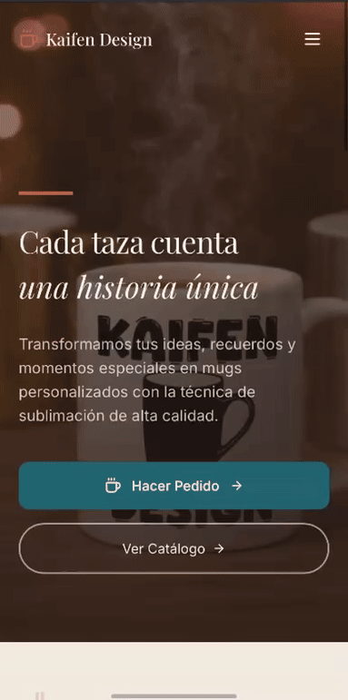

# Kaifen Design ☕ — Plataforma Web para Mugs Personalizables

Aplicación web desarrollada para **Kaifen Design**, un emprendimiento enfocado en la venta de **mugs personalizados**.  
El sistema permite presentar productos, fortalecer la identidad de marca y preparar la base tecnológica para futuras funcionalidades de comercio electrónico.

Este proyecto fue construido con tecnologías modernas de frontend priorizando **escalabilidad, mantenibilidad y experiencia de usuario**.

---
## 🌐 Propósito del producto

La plataforma busca:

- Exhibir el catálogo de mugs
- Comunicar opciones de personalización
- Facilitar el contacto con clientes
- Servir como base para evolucionar a e-commerce

Usuario objetivo:
personas que buscan regalos personalizados o compras por encargo.
---

## 🚀 Demo técnico
## 🌐 Live Demo
https://kaifendesign.netlify.app/
Proyecto desplegado en **Netlify**

Incluye versión productiva generada en `/dist`.

## 🎥 Product Walkthrough

---
### 📱 Mobile Experience

## 🧰 Stack tecnológico

- **React**
- **TypeScript**
- **Vite**
- **Tailwind CSS**
- React Router
- Hooks personalizados
- ESLint
- Vitest (base de testing)
---

## 🧠 Enfoque de arquitectura

El proyecto sigue principios modernos de desarrollo frontend:

✔ Separación por **pages**  
✔ Componentes reutilizables  
✔ Manejo de estado mediante hooks  
✔ Configuración optimizada para build rápido  
✔ Estructura preparada para integración con APIs  
✔ Preparado para serverless functions (carpeta netlify)

---
