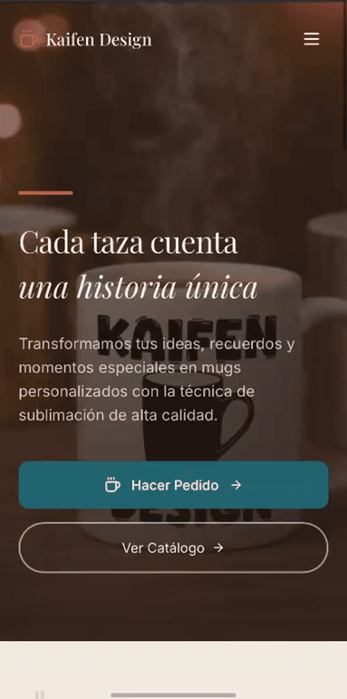

# Kaifen Design ☕ — Custom Mug Web Platform

Web application built for **Kaifen Design**, a brand focused on **custom mugs**.  
The system showcases products, strengthens brand identity, and lays the technical foundation for future e-commerce features.

This project was built with modern frontend technologies, prioritizing **scalability, maintainability, and user experience**.

---
## 🌐 Product purpose

The platform aims to:

- Showcase the mug catalog
- Communicate customization options
- Make it easy to contact customers
- Serve as a foundation for evolving into e-commerce

Target users:
people looking for personalized gifts or custom orders.
---

## 🚀 Technical demo
## 🌐 Live Demo
https://kaifendesign.netlify.app/
Project deployed on **Netlify**

Includes the production build in `/dist`.

## 🎥 Product walkthrough

---
### 📱 Mobile experience

## 🧰 Tech stack

- **React**
- **TypeScript**
- **Vite**
- **Tailwind CSS**
- React Router
- Custom hooks
- ESLint
- Vitest (testing foundation)
---

## 🧠 Architecture approach

The project follows modern frontend principles:

✔ Separation by **pages**  
✔ Reusable components  
✔ State management via hooks  
✔ Optimized fast build configuration  
✔ Structure ready for API integration  
✔ Prepared for serverless functions (netlify folder)
---
